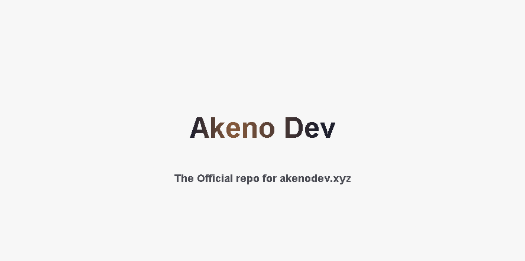

# Akeno Dev Website




[](https://choosealicense.com/licenses/gpl-3.0/)

____

## Authors

- [@akenolol](https://www.github.com/akenolol)
- [@Furdox](https://github.com/Furdox)


## Reference

### Access Home Page

```http
  GET /
```


### Access Redirect Page

```http
  GET /redirect
```

| Parameter | Type     | Description                |
| :-------- | :------- | :------------------------- |
| `url` | `string` | **Required**. The URL to redirect to.|
| `title` | `string` | **OPTIONAL**. The title to give.|


### Access Login Page

```http
  GET /login
```

___


## Run Locally

Clone the project

```bash
  git clone https://github.com/akenolol/akenodev.xyz
```

Go to the project directory

```bash
  cd akenodev.xyz
```

Install dependencies

```bash
  npm install
```

Edit `config.js` to fit your needs.


Start the server

```bash
  npm run start
```


## Support

For support, email [oss@akenodev.xyz](mailto:oss@akenodev.xyz) or join our [Discord Server](https://akenodev.xyz/invite).

